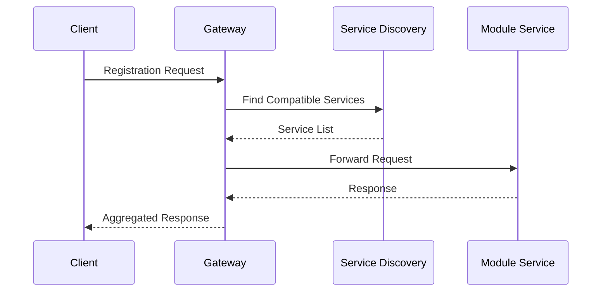
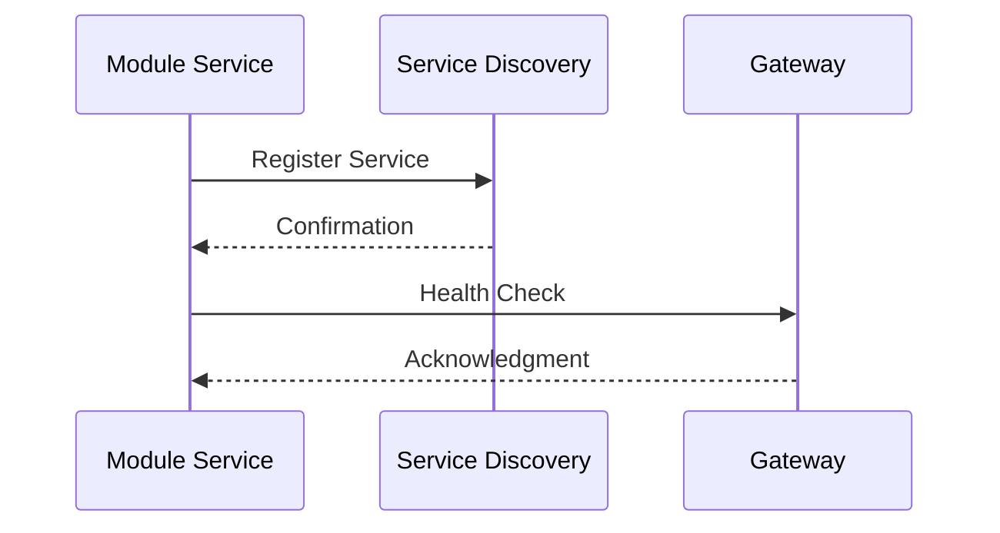

# POP API Architecture V2

## Overview

The POP API is designed as a distributed system with a central API gateway that coordinates with specialized service modules. Each module operates as an independent service, handling specific resource types and registration methods.

## System Components

```
┌──────────────────────────────────────────────────────────────┐
│                      POP API Gateway                         │
│                                                              │
│  ┌─────────────┐  ┌─────────────┐  ┌─────────────────────┐   │
│  │   Routes    │  │  Services   │  │ Module Orchestrator │   │
│  └─────────────┘  └─────────────┘  └─────────────────────┘   │
└──────────────────────────────┬───────────────────────────────┘
                               │
                               ▼
     ┌────────────────────────────────────────────────┐
     │            Service Discovery Layer             │
     └────────────────────────────────────────────────┘
                               │
                               ▼
┌─────────────┐  ┌─────────────┐  ┌─────────────┐  ┌─────────────┐
│    Kafka    │  │     S3      │  │    URL      │  │  Custom     │
│   Service   │  │   Service   │  │   Service   │  │  Services   │
└─────────────┘  └─────────────┘  └─────────────┘  └─────────────┘
```

## Core Services

### 1. API Gateway
- Central entry point for all requests
- Request routing and validation
- Authentication and authorization
- Response aggregation
- Rate limiting and security

### 2. Module Services
Each service is independent and follows these principles:
- Self-contained business logic
- Independent data storage (if needed)
- Own configuration management
- Dedicated API endpoints
- Health monitoring

## Directory Structure

```
pop-api/
├── gateway/                    # Main API Gateway
│   ├── api/
│   │   ├── config/
│   │   │   ├── settings.py
│   │   │   └── module_endpoints.py  # External module configurations
│   │   ├── core/
│   │   ├── routes/
│   │   └── services/
│   │       └── module_connector/    # Service for external module communication
│   └── requirements.txt
│
└── docker/
    ├── docker-compose.yml
    └── .env

# External Module Repositories (Separate GitHub Repos)
external-repos/
├── pop-kafka-service/          # github.com/org/pop-kafka-service
│   ├── api/
│   └── documentation/
│
├── pop-s3-service/            # github.com/org/pop-s3-service
│   ├── api/
│   └── documentation/
│
└── pop-url-service/           # github.com/org/pop-url-service
    ├── api/
    └── documentation/
```

This structure better reflects that:
1. The core POP API is focused on gateway functionality
2. Modules are independent repositories that can be developed and versioned separately
3. Module integration happens through configuration (similar to JupyterHub)
4. Each module maintains its own documentation and deployment process

## Communication Flow

1. **Request Flow**


2. **Service Registration**


## Implementation Details

### 1. Gateway Configuration

```python
# gateway/api/config/settings.py

class Settings(BaseSettings):
    service_discovery_url: str
    auth_enabled: bool = True
    default_timeout: int = 30
    
    # Module-specific settings
    kafka_service_enabled: bool = False
    s3_service_enabled: bool = False
    url_service_enabled: bool = False
```

### 2. Module Interface

```python
# modules/base/interface.py

class ModuleInterface(ABC):
    @abstractmethod
    async def validate(self, metadata: dict) -> bool:
        """Validate if module can handle metadata"""
        pass
    
    @abstractmethod
    async def register(self, metadata: dict) -> dict:
        """Process registration request"""
        pass
    
    @abstractmethod
    async def health_check(self) -> bool:
        """Report service health status"""
        pass
```

### 3. Service Discovery

```python
# gateway/api/services/discovery.py

class ServiceDiscovery:
    async def register_service(self, service_info: dict):
        """Register a new service"""
        pass
    
    async def get_compatible_services(self, metadata: dict) -> List[str]:
        """Find services that can handle the metadata"""
        pass
    
    async def health_check(self) -> Dict[str, bool]:
        """Check health of all registered services"""
        pass
```

## Deployment

### Docker Compose Configuration

```yaml
version: '3.8'

services:
  gateway:
    build: ./gateway
    ports:
      - "8000:8000"
    environment:
      - SERVICE_DISCOVERY_URL=http://discovery:8080
    depends_on:
      - discovery

  discovery:
    build: ./discovery
    ports:
      - "8080:8080"

  kafka-service:
    build: ./modules/kafka-service
    environment:
      - SERVICE_NAME=kafka
      - DISCOVERY_URL=http://discovery:8080

  s3-service:
    build: ./modules/s3-service
    environment:
      - SERVICE_NAME=s3
      - DISCOVERY_URL=http://discovery:8080

  url-service:
    build: ./modules/url-service
    environment:
      - SERVICE_NAME=url
      - DISCOVERY_URL=http://discovery:8080
```

## Security

1. **Authentication**
   - JWT-based authentication
   - Service-to-service authentication
   - Role-based access control

2. **Communication Security**
   - TLS encryption for all services
   - API key authentication between services
   - Request signing for internal communication

## Monitoring

1. **Health Checks**
   - Regular service health monitoring
   - Automatic service recovery
   - Health metrics collection

2. **Logging**
   - Centralized logging
   - Request tracing
   - Error tracking

## Error Handling

1. **Service Failures**
   - Circuit breaker pattern
   - Fallback mechanisms
   - Retry policies

2. **Data Validation**
   - Input validation at gateway
   - Service-specific validation
   - Error response standardization

## Benefits

1. **Scalability**
   - Independent scaling of services
   - Load balancing support
   - Resource optimization

2. **Maintainability**
   - Isolated service updates
   - Independent deployment
   - Simplified testing

3. **Flexibility**
   - Easy addition of new services
   - Technology stack freedom
   - Independent service evolution

## Future Considerations

1. **Service Mesh Integration**
   - Advanced service discovery
   - Traffic management
   - Security policies

2. **Kubernetes Deployment**
   - Container orchestration
   - Automatic scaling
   - Rolling updates

3. **Monitoring Enhancement**
   - Metrics collection
   - Performance tracking
   - Alert management
```

This new architecture provides a clearer separation of concerns, better scalability, and more flexibility for future extensions. Each module operates as an independent service while maintaining coordination through the central API gateway.