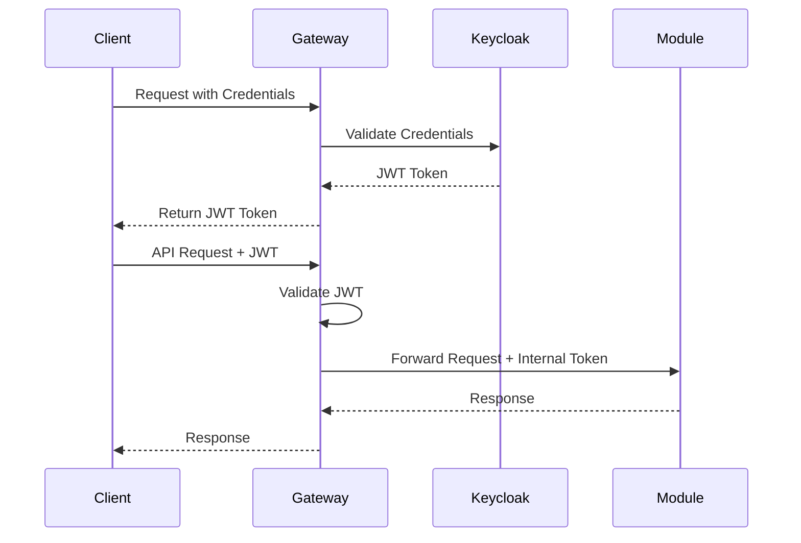

# POP API Security Architecture

## Overview

The POP API implements a comprehensive security model across multiple layers, ensuring secure communication between clients, the gateway, and independent service modules.

## Authentication Flow



## Authentication Methods

### 1. User Authentication (External)
- Primary authentication via Keycloak
- Supports:
  - Username/password authentication
  - OAuth2 password flow
  - Bearer token authentication
- JWT tokens contain:
  - User identity
  - Roles and permissions
  - Token expiration
  - Signature verification

```python
# Example Token Configuration
{
    "iss": "https://keycloak.example.com",
    "sub": "user123",
    "exp": 1735689600,
    "roles": ["user", "admin"],
    "permissions": ["read", "write"],
    "aud": "pop-api"
}
```

### 2. Service-to-Service Authentication (Internal)
- API key-based authentication between gateway and modules
- Mutual TLS (mTLS) for secure service communication
- Internal JWT tokens for module-to-module communication

## Authorization

### 1. Role-Based Access Control (RBAC)
```yaml
roles:
  admin:
    - create_resource
    - delete_resource
    - modify_settings
    - view_metrics
  user:
    - create_resource
    - view_own_resources
  reader:
    - view_public_resources
```

### 2. Module-Specific Permissions
```yaml
module_permissions:
  kafka_service:
    - kafka.create
    - kafka.delete
    - kafka.modify
  s3_service:
    - s3.upload
    - s3.download
    - s3.delete
```

## Security Implementation

### 1. Gateway Security

```python
# Example Gateway Security Middleware
from fastapi import Security, HTTPException
from fastapi.security import OAuth2PasswordBearer, APIKeyHeader

oauth2_scheme = OAuth2PasswordBearer(tokenUrl="token")
api_key_header = APIKeyHeader(name="X-API-Key")

async def verify_token(token: str = Security(oauth2_scheme)):
    try:
        payload = jwt.decode(token, SECRET_KEY, algorithms=["HS256"])
        return payload
    except JWTError:
        raise HTTPException(status_code=401, detail="Invalid token")

async def verify_module_api_key(api_key: str = Security(api_key_header)):
    if not is_valid_module_key(api_key):
        raise HTTPException(status_code=401, detail="Invalid API key")
```

### 2. Module Security

```python
# Example Module Security Configuration
class ModuleSecurity:
    def __init__(self):
        self.gateway_public_key = load_gateway_public_key()
        self.module_private_key = load_module_private_key()
    
    def verify_gateway_request(self, request):
        # Verify gateway signature
        # Validate internal token
        # Check request timestamp
        pass
    
    def sign_response(self, response):
        # Sign response with module private key
        pass
```

## Security Layers

### 1. Transport Security
- TLS 1.3 for all external communications
- mTLS for internal service mesh
- Certificate rotation and management
- Secure key storage

### 2. Application Security
- Input validation
- Request sanitization
- SQL injection prevention
- XSS protection
- CSRF tokens

### 3. Data Security
```yaml
data_security:
  at_rest:
    - AES-256 encryption
    - Secure key management
    - Regular key rotation
  in_transit:
    - TLS 1.3
    - Perfect Forward Secrecy
    - Strong cipher suites
```

## Security Monitoring

### 1. Audit Logging
```python
# Example Audit Log Entry
{
    "timestamp": "2023-10-20T10:15:30Z",
    "action": "resource_creation",
    "user": "user123",
    "service": "kafka_service",
    "resource_id": "res_789",
    "ip_address": "192.168.1.100",
    "status": "success"
}
```

### 2. Security Metrics
- Failed authentication attempts
- Token validation failures
- API key usage patterns
- Request rate monitoring
- Unusual activity detection

## Incident Response

### 1. Automated Responses
- Rate limiting
- IP blocking
- Account lockouts
- Alert generation

### 2. Manual Interventions
- Token revocation
- Service isolation
- Emergency shutdowns
- Security patches

## Configuration Management

### 1. Security Settings
```yaml
security_config:
  token_expiration: 3600
  max_failed_attempts: 5
  lockout_duration: 300
  minimum_password_length: 12
  require_2fa: true
```

### 2. Environment-Specific Settings
```yaml
environments:
  production:
    require_mTLS: true
    allow_test_tokens: false
    audit_level: "full"
  development:
    require_mTLS: false
    allow_test_tokens: true
    audit_level: "basic"
```

## Best Practices

1. **Token Management**
   - Short-lived tokens
   - Regular rotation
   - Secure storage
   - Immediate revocation capability

2. **API Security**
   - Rate limiting
   - Request validation
   - Error handling
   - Security headers

3. **Module Security**
   - Independent security contexts
   - Isolated credentials
   - Separate permissions
   - Individual audit logs
```

This security architecture provides a comprehensive approach to securing the POP API ecosystem while maintaining flexibility for individual module security requirements. The implementation can be adjusted based on specific security needs and compliance requirements.